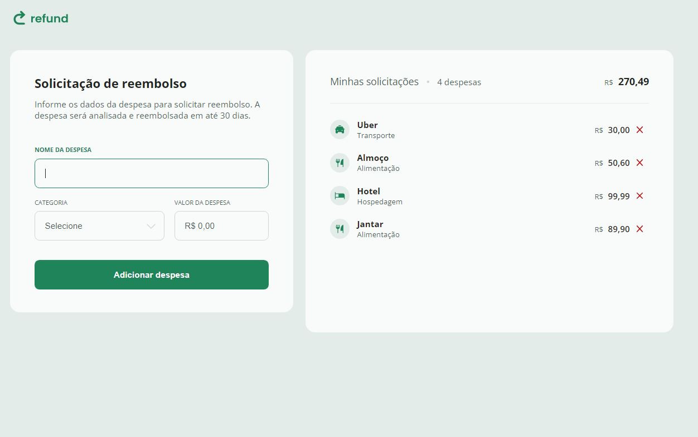

</a>

  <a href="#-tecnologias">Tecnologias</a>&nbsp;&nbsp;|&nbsp;&nbsp;
  <a href="#-projeto">Projeto</a>&nbsp;&nbsp;|&nbsp;&nbsp;
  <a href="#-layout">Layout</a>&nbsp;&nbsp;

 

 
  

## 🚀 Tecnologias

Esse projeto foi desenvolvido com as seguintes tecnologias:

- HTML, CSS, Javascript
- Git e Github
- Figma

## 💻 Projeto

- [Acesse o projeto finalizado, online](https://alexprado2.github.io/Refund/)

## 🔖 Layout

Você pode visualizar o layout do projeto através [DESSE LINK](https://www.figma.com/community/file/1360316109107378379). É necessário ter conta no [Figma](https://figma.com) para acessá-lo.